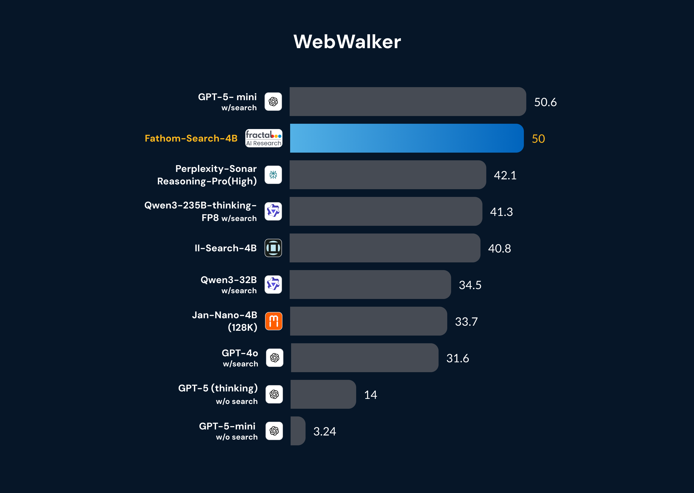
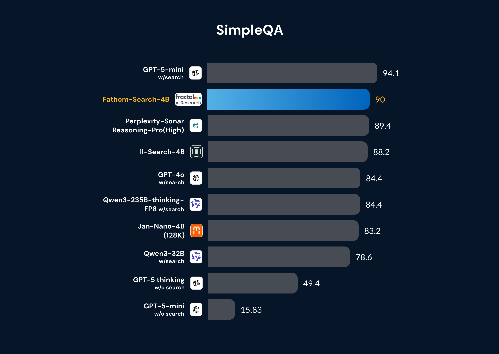
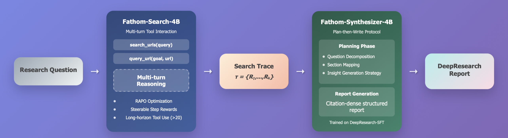

# Fathom-DeepResearch: Unlocking Long Horizon Information Retrieval And Synthesis For SLMs


<div align="center">

[](https://huggingface.co/spaces/FractalAIResearch/Fathom-Search-4B)
[](https://arxiv.org/abs/2509.24107)


</div>

<div align="center">

[](https://huggingface.co/FractalAIResearch/Fathom-Search-4B)
[](https://huggingface.co/FractalAIResearch/Fathom-Synthesizer-4B)

</div>

<div align="center">
  
[](https://huggingface.co/datasets/FractalAIResearch/DuetQA/)
[](https://huggingface.co/datasets/FractalAIResearch/DeepResearch-SFT/)

</div>


---

<!-- <p align="center">        </p>

<p align="center">        </p> -->
<p align="center">        </p>
<p align="center">        </p>


---


## ✨ Introduction


We introduce **Fathom-DeepResearch**, an agentic DeepResearch system that sets *state-of-the-art performance in the open-weights category* on search-intensive benchmarks **(SimpleQA, FRAMES, WebWalkerQA, Seal0)** and *outperforms closed-source DeepResearch agents like (Claude, Grok, Perplexity, GPT-4o)* on open-ended synthesis benchmark **DeepResearch-Bench**. Built on two specialized models, **Fathom-Search-4B**, optimized for long-horizon, evidence-seeking through live web search, and **Fathom-Synthesizer-4B**, designed for open-ended synthesis and report generation. Refer to our **technical report** for our training recipe and more exciting results!

<p align="center">        </p>


## 🤗 Key Release Assets
- 🤗 **[Fathom-Search-4B](https://huggingface.co/FractalAIResearch/Fathom-Search-4B)** & **[🤗 Fathom-Synthesizer-4B](https://huggingface.co/FractalAIResearch/Fathom-Synthesizer-4B)**  
   We opensource two 4B-parameter models trained to browse, extract, verify and reason over live web content, and synthesize the findings into rich citation-dense reports!

- 🌐 **[Fathom-WebAgents](https://github.com/FractalAIResearchLabs/Fathom-DeepResearch/tree/main/serving/web_agents)**  
   We open-source our **search tool server**, built on top of **Jina-AI**, **Crawl4AI**, **Trafilatura**, and **Serper.dev**, which acts as a powerful search backend, optimized to handle large volumes of  **asynchronous requests** and includes specialized handlers for diverse sources such as **YouTube, PDFs, Reddit, Github**, and more.

- 🤗  **[DuetQA](https://huggingface.co/datasets/FractalAIResearch/DuetQA)**  
   We release a ~5K-sample dataset created through our novel *multi-agent self-play pipeline*, containing verifiable question–answer pairs that are impossible to answer without *live web search* , for DeepSearch model training.

- 🤗 **[DeepResearch-SFT](https://huggingface.co/datasets/FractalAIResearch/DeepResearch-SFT)**  
   We are releasing a synthetic SFT corpus used to train **Fathom-Syntheizer-4B**, to enable the conversion of  downstream search/investigation traces of DeepSearch enabled models into DeepResearch reports via our novel *plan-then-write* protocol.

- 📚 **[Technical Report](https://arxiv.org/abs/2509.24107)**  
   We release technical report outlining key training innovations, dataset generation pipeline, complete training startegy and evaluation!


## ✨ Key Innovations  

- 🧭 **Multi-Agent Self-Play**  
  We present a *self-supervised dataset construction framework* designed to yield *verifiable, live web-search enforcing, multi-hop QA pairs*. This pipeline serves as the basis for generating **DUETQA**, a dataset tailored for training *agentic deepsearch models*.  

- ⚡ **RAPO: Reward-Aware Policy Optimization**  
  We introduce **RAPO**, a *zero-overhead extension of GRPO* that stabilizes *multi-turn Reinforcement Learning with Verifiable Rewards* through *curriculum pruning, reward-aware advantage scaling,* and *per-prompt replay buffers* that stabilize long-horizon tool use.  

- 🎯 **Steerable Step-Level Reward**  
  We design our *novel Steerable Step-Level Reward* that alleviates the *reward-hacking challenge* faced by RLVR training in the multi-turn, tool-interaction. Our reward function enables us to steer (i) *how much the agent uses tools* and (ii) *how it allocates cognition* to exploration and verification.  

- 📝 **DeepResearch Report Synthesis Protocol**  
  We propose a novel *plan-then-write protocol* for synthesizing DeepSearch traces into *citation-dense reports*, where planning involves *decomposition* of questions into ordered sub-questions, *evidence-to-section mapping* aligning URLs to the correct sub-question, and *insight planning* to guide synthesis into structured reports.  


---

## 📊 Key Results

<p align="center">        </p>


<p align="center">        </p>


## 🚀 Inference

This section shows how to host **Fathom-DeepResearch** *locally* and run inference!.

### 1) Environment setup

```bash
uv pip install torch==2.7.1 torchvision==0.22.1 torchaudio==2.7.1 --index-url https://download.pytorch.org/whl/cu126
uv pip install --no-build-isolation -r requirements.txt
playwright install-deps
playwright install
```

### 2) Start the Model Servers (SGLang)
Change `--model-path` to your model identifier (eg. `FractalAIResearch/Fathom-Search-4B`) or local path.
#### Fathom-Search-4B
Launch on default port below **8902**, and **GPU 0**
```bash
export CUDA_VISIBLE_DEVICES=0
python -m sglang.launch_server \
          --served-model-name  Fathom-Search-4B \
          --model-path FractalAIResearch/Fathom-Search-4B \
          --enable-metrics \
          --dtype bfloat16 \
          --host 0.0.0.0 \
          --port 8902 \
          --trust-remote-code \
          --disable-radix-cache \
          --disable-cuda-graph \
          --context-length 40960 \
          #--tp 2 #optional for multi-gpu inference
```
#### Fathom-Synthesizer-4B
Launch on default port **8903** and **GPU 1**, we use YARN scaling with RoPE factor 2.0 for the synthesizer model
```bash
export CUDA_VISIBLE_DEVICES=1
python3 -m sglang.launch_server \
         --served-model-name Fathom-Synthesizer-4B \
         --model-path FractalAIResearch/Fathom-Synthesizer-4B \
         --enable-metrics \
         --dtype bfloat16 \
         --host 0.0.0.0 \
         --port 8903 \
         --trust-remote-code \
         --disable-radix-cache \
         --disable-cuda-graph \
         --disable-cuda-graph \
         --context-length 131092 \
         --json-model-override-args '{"rope_type":"yarn","factor":2.0,"original_max_position_embeddings":40960}' \
        #--tp 2 #optional for multi-gpu inference
```
#### (Optional) Query-LLM for search backend
Launch on default port **8905** and **GPU 3**
```bash
export CUDA_VISIBLE_DEVICES=3
python3 -m sglang.launch_server \
         --served-model-name Query-LLM \
         --model-path Qwen3/Qwen3-32B #Any LLM of choice to act as the query LLM for search tool server \
         --enable-metrics \
         --dtype bfloat16 \
         --host 0.0.0.0 \
         --port 8905 \
         --trust-remote-code \
         --disable-radix-cache \
         --disable-cuda-graph \
         --disable-cuda-graph \
         --context-length 131092 \
        #--tp 2 #optional for multi-gpu inference
```

### 3) Fire up the Search Tools Server (Serper + Jina + Query LLM)

<p align="center">        </p>

Set the following in `scripts/.env`:

- **SERPER_API_KEY** (get from serper.dev; ~2,500 free queries without any card) (necessary for live web-search)
- **JINA_API_KEY** (optional) — used in the web-page extraction pipeline (recommended for replicaiion)
- **OPENAI_API_KEY** (optional) — for goal conditioned querying of web-pages using GPT-4.1-mini (recommended for replication)
- **SERPER_CACHE_DIR**  — path to caching the search results from serper.dev to save cost and retrival time 
- **JINA_CACHE_DIR**  — path to caching the search results from jina.ai to save cost and retrival time 

(Recommended) Launch search tool server on **port 8904** with 256 workers with **gpt-4.1-mini** as the Query-LLM (OpenAI API key needed):
```bash
serving/host_server.sh 8904 256 "openai:gpt-4.1-mini"
```
(Or) Launch search tool server on **port 8904** with a **locally hosted LLM of choice** via SGLang at  **port 8905** (See step 2) as the Query-LLM:
```bash
serving/host_server.sh 8904 256 "http://0.0.0.0:8905"
```

Note: Our search backend also supports `web_search` and `web_visit` functions for searching the web and returning entire web-page w/o the need for a Query-LLM.
Used by model like `Jan-Naao` and `II-Search-4B` in their implementation.

### 4) Run DeepResearch! (Single question inference)

Run **Fathom‑DeeoSearch** via `inference.py`:

```bash
 python inference.py \
    --question "Find out the names of all the companies that have been selected under the IndiaAI mission? Write a detailed report on what their deliverables are? What are the ways in which this mission will impact india in the coming decade?" \
    --executors http://0.0.0.0:8904 \
    --model-url http://0.0.0.0:8902 \
    --tokenizer FractalAIResearch/Fathom-Search-4B \
    --summary-llm http://0.0.0.0:8903 \
    --deepresearch #DeepResearch mode!, disable to get Fathom-Search-4B response Faster & shorter
```

Tips:
- Use multiple executors for load‑balancing: `--executors http://0.0.0.0:8904, http://0.0.0.0:8905`.


---

## 🧮 Evaluation (Multi GPU)

This section covers **batched evaluation** using the provided scripts in `scripts/`. Use placeholders `model_path` and `dataset_name` — the evaluator will read `eval_benchmarks/<dataset_name>.jsonl` with columns `['id','question','answer']`.

### Common flags

| Flag | Required | Example | Description |
|---|:---:|---|---|
| `--model-path` | ✅ | `model_path` | Model repo ID or local path. |
| `--model-port` | ⬜ | `1255` | Port where the model server listens (if applicable). |
| `--executors` | ⬜ | `1211,1212` | Comma‑separated tool/extractor workers. |
| `--dataset` | ✅ | `dataset_name` | Looks for `eval_benchmarks/<dataset_name>.jsonl`. |
| `--out-base` | ⬜ | `./results` | Where results are written. |
| `--query-llm` | ⬜ | `gpt-4.1-mini` or `/path/to/Qwen3-4B` | Extractor/Query LLM. |
| `--query-port` | ⬜ | `1260` | Port for a locally served query LLM. |
| `--main-gpus` | ⬜ | `0,1` | CUDA devices for the main model. |
| `--query-gpus` | ⬜ | `2,3` | CUDA devices for the query LLM. |

### Evaluate Fathom‑Search

**GPT-4.1-mini query-LLM on CPU, main model on GPUs 0,1 (TP=2)**

```bash
scripts/eval_fathom_search.sh \
  --model-path FractalAIResearch/Fathom-Search-4B \
  --model-port 1255 \
  --executors 1211,1212 \
  --dataset dataset_name \
  --main-gpus 0,1 \
  --query-llm gpt-4.1-mini
```

**Local Qwen3-32B as Query-LLM on GPUs 2,3 (TP=2); main model on GPUs 0,1 (TP=2)**

```bash
scripts/eval_fathom_search.sh \
  --model-path FractalAIResearch/Fathom-Search-4B \
  --model-port 1255 \
  --executors 1211,1212 \
  --dataset dataset_name \
  --main-gpus 0,1 \
  --query-llm Qwen3/Qwen3-32B \
  --query-port 1260 \
  --query-gpus 2,3
```

### Evaluate other baselines used in the paper 

```bash
# II‑Search‑4B
scripts/eval_ii_search.sh \
  --model-path Intelligent-Internet/II-Search-4B \
  --model-port 1255 \
  --executors 1211,1212 \
  --dataset dataset_name

# Jan‑Nano‑32K
scripts/eval_jan_nano_32K.sh \
  --model-path Menlo/Jan-nano \
  --model-port 1255 \
  --executors 1211,1212 \
  --dataset dataset_name

# Jan‑Nano‑128K
scripts/eval_jan_nano_128K.sh \
  --model-path Menlo/Jan-nano-128k \
  --model-port 1255 \
  --executors 1211,1212 \
  --dataset dataset_name

# R1‑Searcher(7B)
scripts/eval_r1_searcher.sh \
  --model-path XXsongLALA/Qwen-2.5-7B-base-RAG-RL \
  --model-port 1255 \
  --dataset dataset_name

# ZeroSearch
scripts/eval_zerosearch.sh \
  --model-path Alibaba-NLP/ZeroSearch_wiki_V2_Qwen2.5_7B_Instruct \
  --model-port 1255 \
  --dataset dataset_name

# search‑o1 (with Qwen3‑4B)
scripts/eval_search_o1.sh \
  --model-path Qwen3/Qwen3-4B \
  --model-port 1255 \
  --dataset dataset_name

#cleanup ports after eval 
 scripts/cleanup.sh 1255 1211 1212
```

Run 

---

## 📜 License

This repository and all the release assets are available under the MIT License, underscoring our dedication to open and inclusive AI innovation. By freely sharing our work, we aim to democratize AI technology, empowering researchers, developers, and enthusiasts everywhere to use, adapt, and expand upon it without limitation. This open and permissive approach promotes global collaboration, accelerates innovation, and enriches the AI community as a whole.

## Acknowledgments
We would like to acknowledge the following works for enabling our project:
- [Qwen3-4B](https://huggingface.co/Qwen/Qwen-4B)
- [ReCall](https://github.com/Agent-RL/ReCall/tree/main)

---

## 📖 Citation

```bibtex
@misc{fathomdeepsearch2025,
  title={Fathom-DeepResearch: Unlocking Long Horizon Information Retrieval And Synthesis For SLMs},
  author={Shreyas Singh and Pradeep Moturi and Kunal Singh},
  howpublished={\url{https://huggingface.co/FractalAIResearch/Fathom-Search-4B}},
  note={Hugging Face},
  year={2025}
}
```

---


